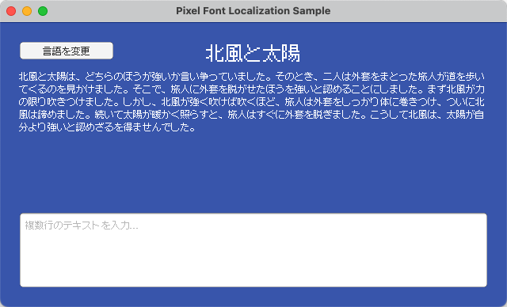
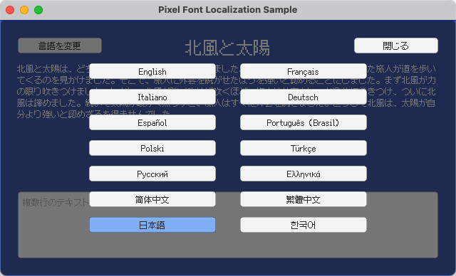

# Unity - ピクセルフォント多言語化サンプル

[English](README.md) | [简体中文](README.zh-Hans.md) | [繁體中文](README.zh-Hant.md) | 日本語 | [한국어](README.ko.md)

## 概要

このプロジェクトは、[Unity](https://unity.com/) に [Fusion Pixel Font](https://github.com/TakWolf/fusion-pixel-font) を統合し、保守しやすい多言語化ワークフローを構築する方法を示します。

Unity 6 でビルドされています。

[Unity Localization パッケージ](https://docs.unity3d.com/Packages/com.unity.localization@1.5/manual/index.html)を使用して、ローカライズ文字列、実行時の言語切り替え、プレイヤーが選択した言語の保存を実装しています。

言語を切り替える際、ローカライズ用のアセットテーブルにより、一致するフォントが動的に切り替わります。これにより、CJK の Unicode 同コードポイント異字形問題（同じコードポイントが言語によって異なる字形を持つ問題）や、CJK と欧文の句読点の違いが正しく処理されます。

正しいピクセルレンダリングを保証するため、OTFのインポート時にフォントサイズ12とHintingレンダリングモードを設定しています。TMPフォントアセットは動的アトラス生成を使用し、レンダリングモードをRASTER_HINTED、テクスチャフィルタリングをPoint、パディングを1とし、圧縮とミップマップを無効にしています。

## 参考資料

- [Unity - Localization Package](https://docs.unity3d.com/Packages/com.unity.localization@1.5/manual/index.html)
- [Unity - TextMesh Pro Documentation](https://docs.unity3d.com/Packages/com.unity.textmeshpro@3.2/manual/index.html)

## 公式コミュニティ

- [Pixel Font Studio - Discord サーバー](https://discord.gg/3GKtPKtjdU)
- [Pixel Font Studio - QQ グループ](https://qm.qq.com/q/jPk8sSitUI)

## ライセンス

サンプルプロジェクトは [MIT License](LICENSE) のもとで提供されています。

このプロジェクトで使用している [Fusion Pixel Font](https://github.com/TakWolf/fusion-pixel-font) は、[SIL Open Font License version 1.1](Assets/PixelFontLocalization/Fonts/Source/fusion-pixel/OFL.txt) のもとで提供されています。

サンプルテキストは [The North Wind and the Sun](https://github.com/TakWolf/the-north-wind-and-the-sun) プロジェクトから引用しており、[CC0 1.0 Universal](https://github.com/TakWolf/the-north-wind-and-the-sun/blob/master/LICENSE) のもとで提供されています。
