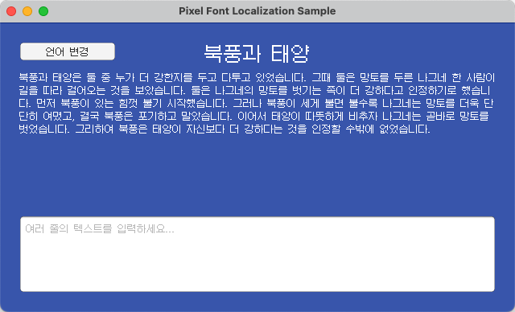
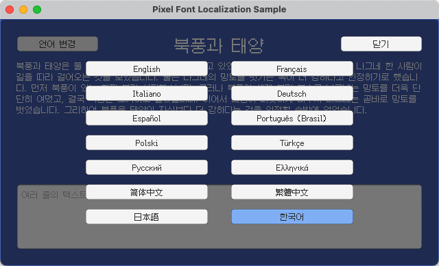

# Unity - 픽셀 폰트 현지화 예제

[English](README.md) | [简体中文](README.zh-Hans.md) | [繁體中文](README.zh-Hant.md) | [日本語](README.ja.md) | 한국어

## 개요

이 프로젝트는 [Unity](https://unity.com/)에 [Fusion Pixel Font](https://github.com/TakWolf/fusion-pixel-font)를 통합하고 유지 관리하기 쉬운 현지화 워크플로를 구축하는 방법을 보여 줍니다.

Unity 6로 빌드되었습니다.

[Unity Localization 패키지](https://docs.unity3d.com/Packages/com.unity.localization@1.5/manual/index.html)를 사용하여 현지화 문자열, 런타임 언어 전환, 플레이어가 선택한 언어의 저장을 구현합니다.

언어를 전환할 때 현지화 에셋 테이블을 통해 일치하는 폰트가 동적으로 전환됩니다. 이를 통해 CJK의 Unicode 동일 코드 포인트 이체자 문제와 CJK 및 서양 문장 부호의 차이를 올바르게 처리합니다.

올바른 픽셀 렌더링을 보장하기 위해 OTF 가져오기 시 폰트 크기 12와 Hinting 렌더링 모드를 설정합니다. TMP 폰트 에셋은 동적 아틀라스 채우기를 사용하며, 렌더링 모드는 RASTER_HINTED, 텍스처 필터링은 Point, 패딩은 1로 설정하고 압축과 밉맵은 비활성화합니다.

## 참고 자료

- [Unity - Localization Package](https://docs.unity3d.com/Packages/com.unity.localization@1.5/manual/index.html)
- [Unity - TextMesh Pro Documentation](https://docs.unity3d.com/Packages/com.unity.textmeshpro@3.2/manual/index.html)

## 공식 커뮤니티

- [Pixel Font Studio - Discord 서버](https://discord.gg/3GKtPKtjdU)
- [Pixel Font Studio - QQ 그룹](https://qm.qq.com/q/jPk8sSitUI)

## 라이선스

예제 프로젝트는 [MIT License](LICENSE)에 따라 배포됩니다.

이 프로젝트에서 사용하는 [Fusion Pixel Font](https://github.com/TakWolf/fusion-pixel-font)는 [SIL Open Font License version 1.1](Assets/PixelFontLocalization/Fonts/Source/fusion-pixel/OFL.txt)에 따라 배포됩니다.

예제 텍스트는 [The North Wind and the Sun](https://github.com/TakWolf/the-north-wind-and-the-sun) 프로젝트에서 가져왔으며 [CC0 1.0 Universal](https://github.com/TakWolf/the-north-wind-and-the-sun/blob/master/LICENSE)에 따라 배포됩니다.
