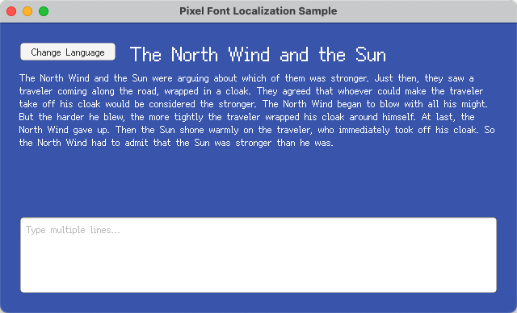
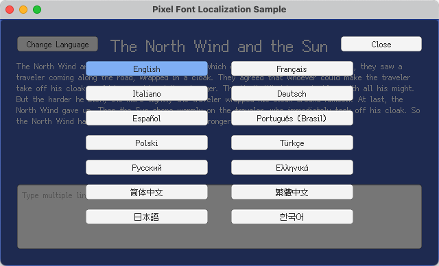

# Unity - Pixel Font Localization Sample

English | [简体中文](README.zh-Hans.md) | [繁體中文](README.zh-Hant.md) | [日本語](README.ja.md) | [한국어](README.ko.md)

## Overview

This project demonstrates how to integrate [Fusion Pixel Font](https://github.com/TakWolf/fusion-pixel-font) in [Unity](https://unity.com/) and establish a maintainable localization workflow.

Built with Unity 6.

It uses the [Unity Localization package](https://docs.unity3d.com/Packages/com.unity.localization@1.5/manual/index.html) for localized strings, runtime locale switching, and persisted player locale selection.

When the locale is switched, the matching font is dynamically selected through the localization asset table. This correctly handles CJK Unicode unification, where the same codepoint may have different glyph forms across languages, as well as the difference between CJK and Western punctuation.

To ensure correct pixel rendering, the OTF is imported with font size 12 and Hinting rendering mode. The TMP Font Assets use dynamic atlas population with RASTER_HINTED render mode, Point texture filtering, padding 1, no compression, and no mipmaps.

## References

- [Unity - Localization Package](https://docs.unity3d.com/Packages/com.unity.localization@1.5/manual/index.html)
- [Unity - TextMesh Pro Documentation](https://docs.unity3d.com/Packages/com.unity.textmeshpro@3.2/manual/index.html)

## Official Community

- [Pixel Font Studio - Discord Server](https://discord.gg/3GKtPKtjdU)
- [Pixel Font Studio - QQ Group](https://qm.qq.com/q/jPk8sSitUI)

## License

The sample project is licensed under the [MIT License](LICENSE).

The [Fusion Pixel Font](https://github.com/TakWolf/fusion-pixel-font) used by this project is licensed under the [SIL Open Font License, Version 1.1](Assets/PixelFontLocalization/Fonts/Source/fusion-pixel/OFL.txt).

The sample text is sourced from [The North Wind and the Sun](https://github.com/TakWolf/the-north-wind-and-the-sun) project and is licensed under [CC0 1.0 Universal](https://github.com/TakWolf/the-north-wind-and-the-sun/blob/master/LICENSE).
