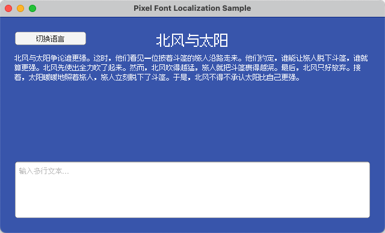
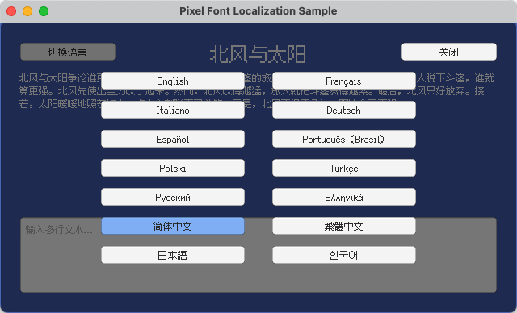

# Unity - 像素字体本地化示例

[English](README.md) | 简体中文 | [繁體中文](README.zh-Hant.md) | [日本語](README.ja.md) | [한국어](README.ko.md)

## 概述

本项目演示在 [Unity](https://unity.com/) 中集成 [Fusion Pixel Font](https://github.com/TakWolf/fusion-pixel-font) 并建立可维护的本地化流程。

基于 Unity 6 构建。

使用 [Unity Localization 包](https://docs.unity3d.com/Packages/com.unity.localization@1.5/manual/index.html) 处理本地化字符串、运行时语言切换和玩家语言选择的持久化。

切换语言时，会通过本地化资产表动态切换匹配的字体。这样可以正确处理 CJK 中 Unicode 同码异形问题，以及中西文标点符号不一样的问题。

为保证正确的像素化渲染，OTF 导入时设置了字号 12 和 Hinting 渲染模式。TMP 字体资产采用动态图集填充，渲染模式为 RASTER_HINTED，纹理过滤为 Point，内边距为 1，不启用压缩和多级渐远纹理（mipmap）。

## 参考资料

- [Unity - Localization Package](https://docs.unity3d.com/Packages/com.unity.localization@1.5/manual/index.html)
- [Unity - TextMesh Pro Documentation](https://docs.unity3d.com/Packages/com.unity.textmeshpro@3.2/manual/index.html)

## 官方社区

- [像素字体工房 - Discord 服务器](https://discord.gg/3GKtPKtjdU)
- [像素字体工房 - QQ 群](https://qm.qq.com/q/jPk8sSitUI)

## 许可证

示例项目采用 [MIT License](LICENSE) 授权。

项目使用的 [Fusion Pixel Font](https://github.com/TakWolf/fusion-pixel-font) 遵循 [SIL Open Font License version 1.1](Assets/PixelFontLocalization/Fonts/Source/fusion-pixel/OFL.txt) 授权。

示例文本来自 [The North Wind and the Sun](https://github.com/TakWolf/the-north-wind-and-the-sun) 项目，遵循 [CC0 1.0 Universal](https://github.com/TakWolf/the-north-wind-and-the-sun/blob/master/LICENSE) 授权。
