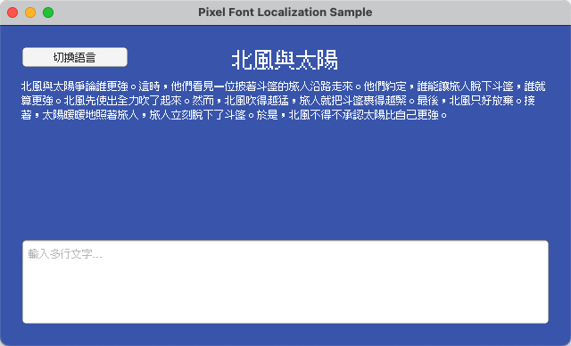
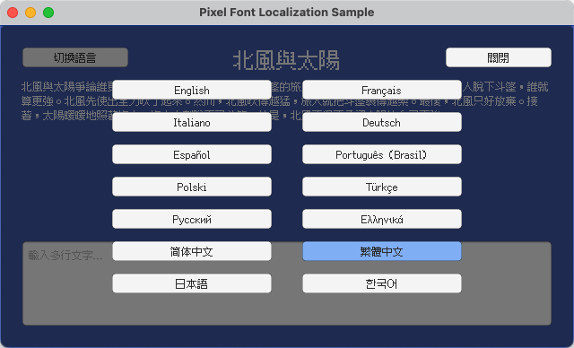

# Unity - 像素字體本地化範例

[English](README.md) | [简体中文](README.zh-Hans.md) | 繁體中文 | [日本語](README.ja.md) | [한국어](README.ko.md)

## 概述

本專案示範在 [Unity](https://unity.com/) 中整合 [Fusion Pixel Font](https://github.com/TakWolf/fusion-pixel-font) 並建立可維護的本地化流程。

基於 Unity 6 建構。

使用 [Unity Localization 套件](https://docs.unity3d.com/Packages/com.unity.localization@1.5/manual/index.html) 處理本地化字串、執行階段語言切換，以及玩家語言選擇的持久化。

切換語言時，會透過本地化資產表動態切換匹配的字體。這樣可以正確處理 CJK 中 Unicode 同碼異形問題，以及中西文標點符號不一樣的問題。

為保證正確的像素化渲染，OTF 匯入時設定了字號 12 和 Hinting 渲染模式。TMP 字體資產採用動態圖集填充，渲染模式為 RASTER_HINTED，紋理過濾為 Point，內邊距為 1，不啟用壓縮和多級漸遠紋理（mipmap）。

## 參考資料

- [Unity - Localization Package](https://docs.unity3d.com/Packages/com.unity.localization@1.5/manual/index.html)
- [Unity - TextMesh Pro Documentation](https://docs.unity3d.com/Packages/com.unity.textmeshpro@3.2/manual/index.html)

## 官方社群

- [像素字體工房 - Discord 伺服器](https://discord.gg/3GKtPKtjdU)
- [像素字體工房 - QQ 群](https://qm.qq.com/q/jPk8sSitUI)

## 授權條款

範例專案採用 [MIT License](LICENSE) 授權。

專案使用的 [Fusion Pixel Font](https://github.com/TakWolf/fusion-pixel-font) 遵循 [SIL Open Font License version 1.1](Assets/PixelFontLocalization/Fonts/Source/fusion-pixel/OFL.txt) 授權。

範例文字來自 [The North Wind and the Sun](https://github.com/TakWolf/the-north-wind-and-the-sun) 專案，遵循 [CC0 1.0 Universal](https://github.com/TakWolf/the-north-wind-and-the-sun/blob/master/LICENSE) 授權。
